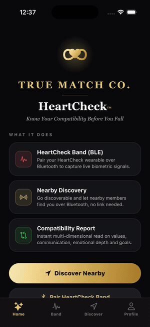
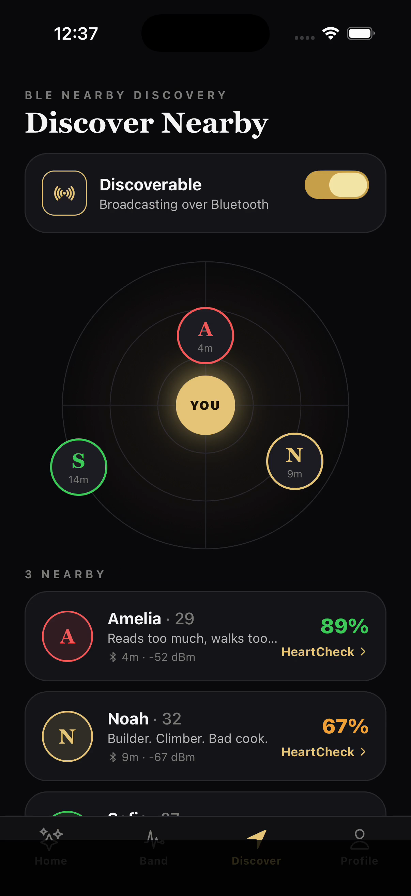
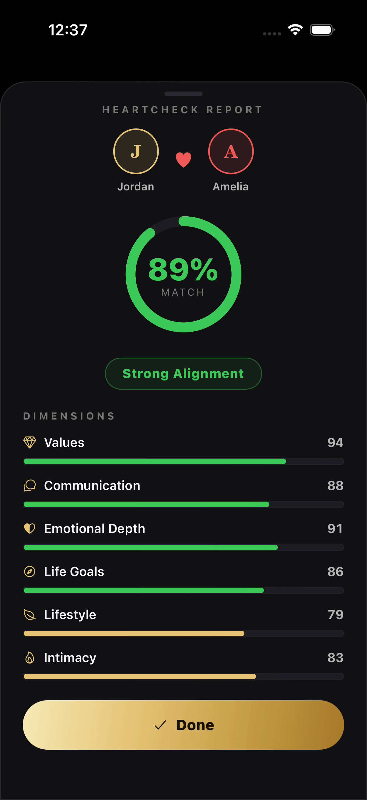
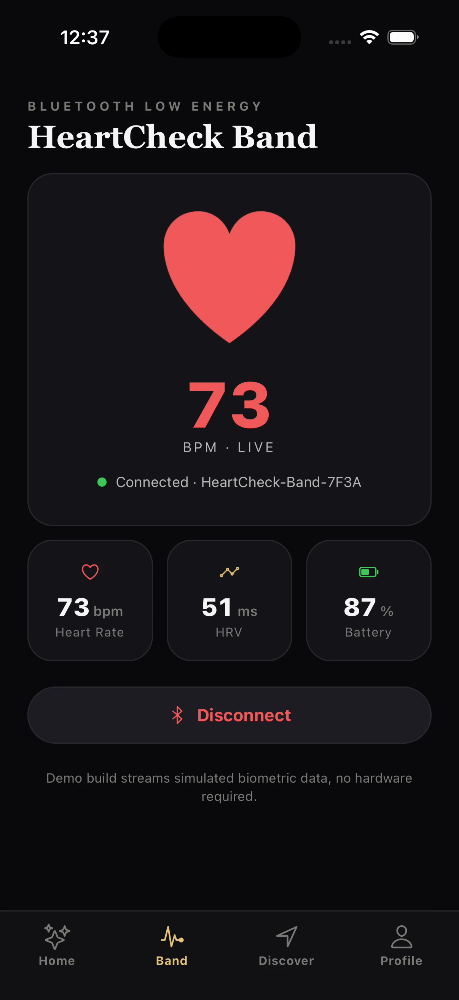
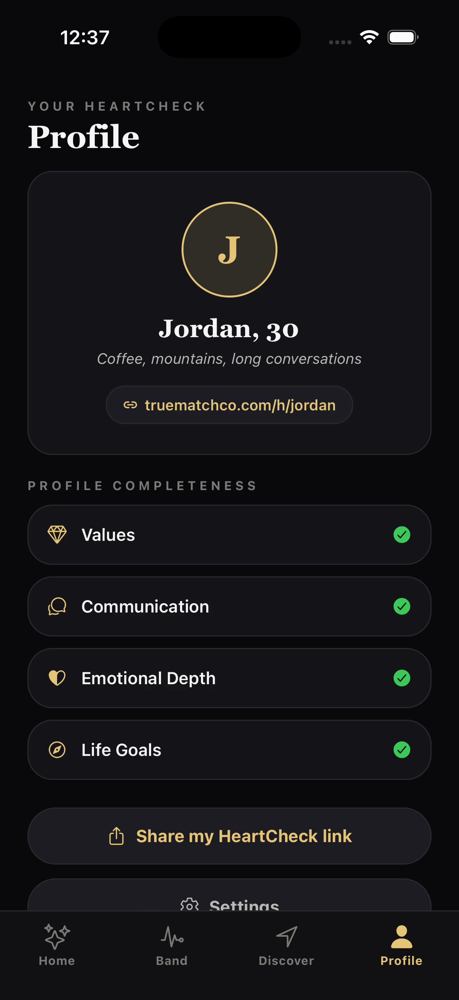

# HeartCheck - TrueMatch Co. (React Native BLE demo)

A React Native / Expo demo of the **HeartCheck™** native app concept for
[truematchco.com](https://truematchco.com): a premium interpersonal compatibility
tool whose one feature a website cannot do is **Bluetooth Low Energy Nearby
Discovery**.

Go *Discoverable*, let nearby members find you over Bluetooth with no prior
interaction or shared link, run an instant multi-dimensional compatibility
**HeartCheck**, and stream live signals from a **HeartCheck band** over BLE.

Brand (black + champagne-gold, serif wordmark, infinity-heart mark) is taken from
truematchco.com. BLE here is **simulated with dummy data** so the whole app runs on
a bare iOS Simulator with no hardware.

## Demo

One hands-free pass through the full flow (~33s, captured on iPhone 17 Pro):

<p align="center"></p>

| Home | Nearby Discovery (BLE) | HeartCheck Report | HeartCheck Band (BLE) | Profile |
|---|---|---|---|---|
|  |  |  |  |  |

## What it shows

- **Nearby Discovery** - toggle *Discoverable* and broadcast over BLE; nearby
  members surface one by one on a live radar (positioned by BLE-estimated distance
  + RSSI). Tap one to start a HeartCheck with **no prior connection or shared
  link** - the feature a website can't replicate.
- **HeartCheck compatibility report** - a BLE handshake exchanges profiles, then an
  instant multi-dimensional read: an overall match score plus **Values,
  Communication, Emotional Depth, Life Goals, Lifestyle, Intimacy** (the model
  surfaced on truematchco.com).
- **HeartCheck band (BLE)** - pair a HeartCheck wearable and stream live heart rate,
  HRV and battery, with the on-screen heart beating at the streamed BPM.
- **Profile** - your HeartCheck profile, personal share link, and profile
  completeness.

## Architecture

```
App.tsx                  tab shell (Home / Band / Discover / Profile) + report modal
src/store.ts             Zustand store: mock BLE device, discovery, report session
src/data.ts              dummy nearby members + compatibility dimensions
src/theme.ts             brand tokens (black + gold + coral, serif)
src/autopilot.ts         optional self-driving demo loop (DEMO flag)
src/components/          Logo (SVG infinity-heart), Radar, HeartPulse, UI kit
src/screens/             Home, Device (Band), Discovery, Profile, ReportModal
```

- **Expo SDK 56 + TypeScript**, **Zustand** for state, **react-native-svg** for the
  logo / radar / score ring, **expo-linear-gradient** for the gold gradients,
  **expo-haptics** for tap feedback.
- All Bluetooth is behind the store, so swapping the mock for
  **`react-native-ble-plx`** (band GATT) + BLE advertise/scan (Nearby Discovery) is
  a store-layer change; the screens don't change.

## Run

```bash
npm install
npx expo run:ios --device "iPhone 17 Pro"
```

Expo Go cannot host SDK 56 here, so the app runs as a native debug build (first run
does `expo prebuild` + CocoaPods + `xcodebuild`).

---

*Demo build. BLE is simulated (dummy data); no backend and no hardware required.*
